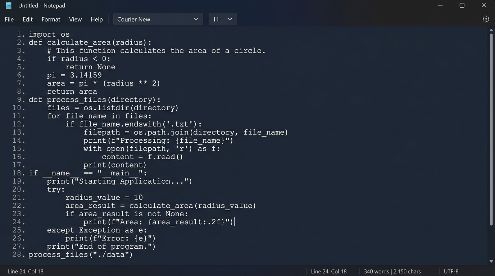
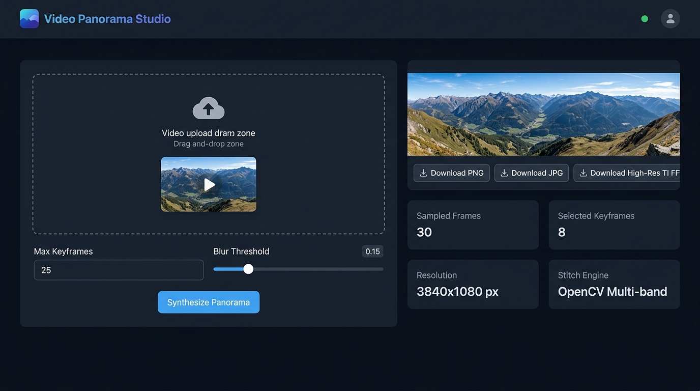

# Python Projects Collection

A curated collection of production-ready Python applications featuring Tkinter desktop applications and Flask computer vision web applications. Every project is fully functional, structured, and thoroughly documented.

---

## 📁 Repository Overview

| Project | Type | Description | Subdirectory | Quick Run |
| :--- | :--- | :--- | :--- | :--- |
| **Instagram User Details** | Desktop GUI (Tkinter) | Real-time Instagram profile statistics, metadata, and avatar viewer | [`instagram-user-details/`](instagram-user-details/) | `python instauserdetails.py` |
| **Random Name Generator** | Desktop GUI (Tkinter) | Realistic first, last, and full name generator with gender filters & batch copy | [`name-generator/`](name-generator/) | `python namegenerator.py` |
| **Notepad Application** | Desktop GUI (Tkinter) | Full-featured text editor with typography controls, status bar, and file I/O | [`notepad-app/`](notepad-app/) | `python notepad.py` |
| **Video Panorama Generator** | Web App (Flask + OpenCV) | Computer vision video-to-panorama image synthesizer | [`video-panorama-generator/`](video-panorama-generator/) | `python python.py` |

---

## 🚀 Quickstart & Setup

### Prerequisites

Ensure you have Python 3.8+ installed on your system.

### Installation

Clone the repository and install all dependencies:

```bash
git clone https://github.com/jhasabhishek17/python-project.git
cd python-project
pip install -r instagram-user-details/requirements.txt -r name-generator/requirements.txt -r video-panorama-generator/requirements.txt
```

---

## 🛠 Project Index & Documentation

### 1. 📷 [Instagram User Details App](instagram-user-details/README.md)
Look up public Instagram user details instantly with a sleek dark-themed desktop GUI.


- **Features**: Follower/Following counts, total post count, bio link, verification status, private/business indicators, profile picture viewer.
- **How It Works**: Asynchronous background fetching prevents UI freeze during network requests; renders stats cards & full-res avatar.
- **Run**:
  ```bash
  python instagram-user-details/main.py
  ```

### 2. 🎲 [Random Name Generator](name-generator/README.md)
Generate realistic human names for testing or mock data generation.


- **Features**: Filter by Male/Female/Random, Full/First/Last name types, count controls (1 to 50), copy all to clipboard.
- **How It Works**: Custom name combination engine with fallback fallback lists, supporting instant batch copying to system clipboard.
- **Run**:
  ```bash
  python name-generator/main.py
  ```

### 3. 📝 [Notepad Application](notepad-app/README.md)
A clean, cross-platform text editor with full editing capabilities.



- **Features**: Open/Save/Save As, Undo/Redo, Live Font Selection with preview, Word Wrap toggle, real-time line/word/character status bar.
- **How It Works**: Native Tkinter ScrolledText widget with line-number margin margin calculation, event bindings, and live status bar counters.
- **Run**:
  ```bash
  python notepad-app/main.py
  ```

### 4. 🖼 [Video Panorama Generator](video-panorama-generator/README.md)
A Flask computer vision web app that converts video clips into stitched panoramas.



- **Features**: Keyframe extraction, scene change detection, OpenCV panorama stitching, fallback feather blending, drag-and-drop web UI.
- **How It Works**: Laplacian variance filtering selects sharp panning keyframes; multi-band blending or RANSAC homography synthesizes seamless panorama images with automatic ROI border cropping.
- **Run**:
  ```bash
  python video-panorama-generator/app.py
  ```

---

## 📄 License

This repository is open source and available for personal and educational projects.
