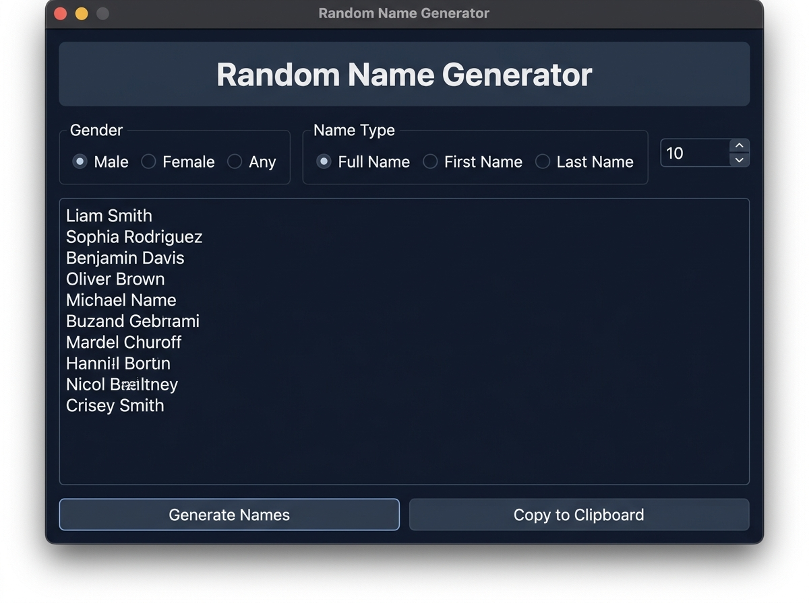

# Random Name Generator

A Python Tkinter desktop application for generating random, realistic human names (first names, last names, and full names) based on gender and customizable quantity counts.



---

## 📸 How It Looks & Works

1. **Configure Parameters**:
   - **Gender**: Male, Female, or Any
   - **Name Type**: Full Name, First Name, or Last Name
   - **Quantity**: Set desired total names (1 to 50)
2. **Generate Results**: Click **Generate Names** to render names instantly in the scrollable view box.
3. **Copy to Clipboard**: Click **Copy to Clipboard** to copy the generated list directly for mock data testing or game development.

---

## Features

- **Gender Filtering**: Generate names specifically for Male, Female, or Random gender.
- **Name Types**: Choose between Full Name, First Name, or Last Name.
- **Batch Generation**: Generate multiple names (1 to 50) in a single click.
- **Clipboard Export**: Quick button to copy all generated names to clipboard.
- **Output Management**: Clear and append options for managing generated results.

## Installation

1. Navigate to the project directory:
   ```bash
   cd name-generator
   ```
2. Install requirements:
   ```bash
   pip install -r requirements.txt
   ```

## Usage

Run the main script:
```bash
python main.py
```
Or run from root directory:
```bash
python namegenerator.py
```

1. Select **Gender** (Male, Female, Random).
2. Select **Type** (Full Name, First Name, Last Name).
3. Set **Count** (e.g. 5).
4. Click **Generate Names** and copy results to your clipboard.

## Dependencies

- `names`
- `tkinter` (Standard Python Library)
